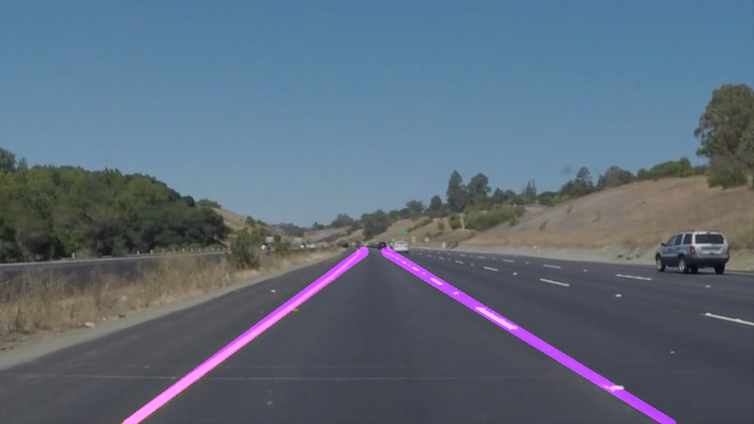

# **Finding Lane Lines on the Road** 

## Writeup 

---

**Finding Lane Lines on the Road**

The goals / steps of this project are the following:
* Make a pipeline that finds lane lines on the road
* Reflect on your work in a written report

[//]: # (Image References)

[image1]: ./test_images_output/solidYellowCurve.jpg "Grayscale"

---

### Reflection

### 1. Describe your pipeline. As part of the description, explain how you modified the draw_lines() function.

  My pipeline(although, in the code I call it "draw_traffic_lane") consisted of 5 steps.
  
* First, I converted the images to grayscale, and then I blur it using gaussian_blur. I belive this blurring process is for smoothing the picture and reduce and frequency noise which my reduce the performance of Canny.

* Second, I apply the Canny_edge detection to the blurred image the get all the edges of the image.

* Third, I choose the vertice to be the region of interest, meaning we will focus only the region where traffic lane is occur(in case the camera postion is fixed.) 

* Fourth, I masking Canny_edge image with the filter from third step and the use this as an input of hough transformation.
hough transfomation will try to draw_the line however to get a clear long straight for both left line and righ line we need sub-step which is in the next section "Drawing line Algorithm"

* lastly I combine the resutl with the original image by applying some weight;

##### Drawing line Algorithm
* 1. separate line segments into left and right lines one have positive value and one with negative value
* 2. calculate average slope and intercept for each line
* 3. considering all line segments calculate y_min value so the line won't go beyond the road
* 4. Set height of the image into the y_max value
* 5. calculate x_min and x_max values using intercept, slope, y_min and y_max

### 2. Identify potential shortcomings with your current pipeline

There are two shortcoming that I found;

* 1. there are some sort of traffic line(not lane) appear near The usual lane line region.
It is really hard to filter it out and if there are alot of them near by it can cause the LaneLine detection go wrong. Usaully move toward those particular lane.

* 2. Some time the lane line is far apart with alot of space (a dash line) and it can confuse the Lane Detection. This problem can be see clearly on video at some moment.

### 3. Suggest possible improvements to your pipeline

A possible improvement would be to ...

From issue when detect Lane Line in Video the detected Line sometime oscilalated and sometime disappear in short amount of time.
Well the Lane line shouldn't be able to disapper within a second. we might be able to use this continuouly frame of lane detection. Meaning we might insert some kind of low pass filter to not allow a Detected line to move so fast in the video.
